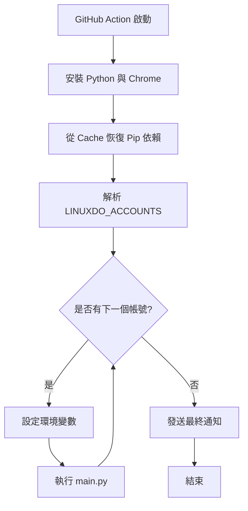

# Linux.do 多帳號支援與效能優化計畫

本計畫旨在以「最小變更」且「不產生 Conflict」的前提下，為 linux.do 自動登入腳本提供多帳號支援，並優化 GitHub Actions 的執行效率以節省計費時間。

## 1. 核心方案：GitHub Actions Shell 循環

我們將不修改 [`main.py`](main.py) 的任何代碼。相反，我們將修改 GitHub Actions 的工作流文件，使其能夠循環處理多個帳號。

### 方案優點
- **零 Conflict**：由於不改動 [`main.py`](main.py)，您可以隨時同步上游倉庫的更新，而不會遇到代碼衝突。
- **節省成本**：在同一個 Job 中順序執行多個帳號，避免了多次啟動虛擬機和重複安裝依賴的開銷。
- **易於維護**：帳號資訊集中管理。

## 2. 實施步驟

### A. 配置 GitHub Secrets
您需要將原有的 `LINUXDO_USERNAME` 和 `LINUXDO_PASSWORD` 替換（或新增）為一個新的 Secret：
- **Secret 名稱**: `LINUXDO_ACCOUNTS`
- **Secret 格式**: `帳號1:密碼1,帳號2:密碼2,帳號3:密碼3`
  *(注意：帳號與密碼之間用冒號 `:` 分隔，不同帳號之間用逗號 `,` 分隔)*

### B. 修改工作流文件 [`.github/workflows/daily-check-in.yml`](.github/workflows/daily-check-in.yml)

1. **引入快取機制**：
   使用 `actions/setup-python` 的 `cache: 'pip'` 功能，快取 `requirements.txt` 中的依賴包。

2. **修改執行邏輯**：
   將原本的 `python main.py` 替換為 Bash 循環腳本。

```bash
IFS=',' read -ra ADDR <<< "$LINUXDO_ACCOUNTS"
for i in "${ADDR[@]}"; do
  IFS=':' read -ra DETAILS <<< "$i"
  export LINUXDO_USERNAME="${DETAILS[0]}"
  export LINUXDO_PASSWORD="${DETAILS[1]}"
  echo "正在為帳號 ${LINUXDO_USERNAME} 執行簽到..."
  python main.py
done
```

## 3. 效能優化對比

| 優化項          | 說明                 | 預期效果                               |
| :-------------- | :------------------- | :------------------------------------- |
| **Pip Cache**   | 快取 Python 依賴包   | 減少約 30-60 秒的安裝時間              |
| **單 Job 循環** | 避免 Matrix 啟動開銷 | 每個額外帳號節省約 30 秒的環境準備時間 |

## 4. 系統架構圖 (Mermaid)



## 5. 徵求意見
1. 您是否接受將帳號密碼以 `user:pass,user:pass` 的格式存放在一個 Secret 中？
2. 目前方案會讓每個帳號執行完後都發送一次通知（Gotify/Server醬等），這是否符合您的需求？
3. 如果您有特殊的通知需求（例如所有帳號跑完才發一次總結），我們需要額外撰寫一個簡單的 wrapper 腳本。

請確認以上計畫，若無問題我將切換至 Code 模式進行修改。
